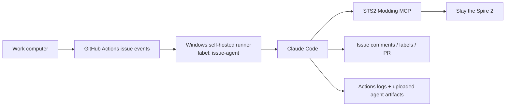

# Azure VMSS Worker Bootstrap

This document is the current VMSS direction after removing the old queue-worker and bridge-request architecture.

## Goal

Build Windows workers that can:

- run GitHub Actions jobs
- launch Claude Code headlessly
- use the STS2 Modding MCP server directly
- support remote visibility through Actions logs and uploaded artifacts

## Target Topology

GitHub Actions is the queue. There is no repo-owned queue worker or scheduled task layer in this model.

## Worker Image Requirements

Each worker image should already contain:

- Steam
- Slay the Spire 2
- GitHub Actions runner
- Git
- GitHub CLI
- .NET 9 SDK
- Python 3.12
- Claude Code installed at `D:\automation\claude-code`
- STS2 Modding MCP installed at `D:\repos\sts2-modding-mcp`

Recommended stable paths:

- `D:\repos\card-utility-stats`
- `D:\repos\sts2-modding-mcp`
- `D:\SteamLibrary\steamapps\common\Slay the Spire 2`
- `D:\automation\claude-code`

## Runner Labels

For the current issue-agent model, the important label is:

- `issue-agent`

That label now means "runner that can process one issue-agent job."

## Auth

The runner should be able to:

- use Azure OIDC through GitHub Actions
- read Azure Key Vault secret `card-utility-stats`
- expose that secret to Claude Code as `ANTHROPIC_API_KEY`

## Validation

Minimum validation checklist for a new VMSS node:

1. runner comes online with `self-hosted`, `windows`, and `issue-agent`
2. `.mcp.json` exists in the repo checkout
3. `claude.exe mcp list` shows `sts2-modding`
4. STS2 MCP bridge ports are reachable when the game is running
5. a test issue-agent run uploads:
   - `claude-issue-agent-events.jsonl`
   - `claude-issue-agent-summary.log`
   - `claude-issue-agent-debug.log`

## What Was Removed

This VMSS direction no longer depends on:

- queue-worker scheduled tasks
- repo-managed scenario manifests
- worker-local live-driver scripts
- filesystem bridge request directories
- in-game `active-request.json` automation
