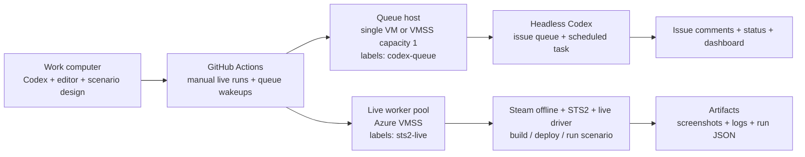

# Azure VMSS Worker Bootstrap

This document turns the issue-51 worker-pool idea into an operational Azure plan.

The goal is:

- no STS2 install on the primary work machine
- repeatable Windows workers for live scenario execution
- enough structure to scale later without rethinking the whole pipeline

## IaC Entry Point

The repo-owned infrastructure entry point for the first VMSS shell now lives at [infra/opentofu/azure-vmss/README.md](../infra/opentofu/azure-vmss/README.md).

That slice is intentionally limited to:

- network and outbound egress
- an optional temporary builder VM for the image-seeding phase
- the Windows VMSS shell
- GitHub Actions based OpenTofu plan/apply
- the Azure OIDC handoff expected from `infra-bootstrap`

It does not yet replace the guest bootstrap and golden image work described below.

## Target Topology

Phase 1 can combine the queue host and live worker onto one VM or one VMSS instance, but only while capacity remains `1`.

## Recommended Deployment Phases

### Phase 0: Provision One Builder VM

Before building a scale set, provision one temporary Windows builder VM from the OpenTofu root and prove the exact workflow there.

Checklist:

- set `enable_builder_vm = true`
- set `enable_vmss = false`
- set the Key Vault secret `card-utility-stats-rdp-allowed-cidrs` to your current public IP as a JSON array, or set `enable_rdp_rule` / `rdp_allowed_cidrs` directly for non-CI runs
- install PowerShell 7
- install Git
- install GitHub CLI
- install .NET 9 SDK
- install Steam
- install Slay the Spire 2
- launch STS2 once and confirm Steam offline mode is stable
- install GitHub Actions runner and apply labels `sts2-live` and `codex-queue`
- install the worker-local live driver and any MCP/window automation dependencies
- run `Live STS2 Manual Test` with `execute_live_driver=false`
- run `Live STS2 Manual Test` with `execute_live_driver=true`

If this VM is also the queue host, additionally:

- configure `gh auth` for unattended issue and PR commands
- configure Codex auth on the machine
- install the queue scheduled task with [ops/codex-queue/Install-IssueQueueWorkerTask.ps1](../ops/codex-queue/Install-IssueQueueWorkerTask.ps1)

### Phase 1: Capture The Golden Image

The image should already contain the slow, stateful setup steps:

- Windows version and updates pinned to a known-good baseline
- Steam installed
- Slay the Spire 2 installed under a stable path
- STS2 launched once so first-run prompts are already resolved
- PowerShell 7, Git, GitHub CLI, and .NET 9 installed
- a predictable folder layout such as:
  - `D:\SteamLibrary\steamapps\common\Slay the Spire 2`
  - `D:\automation\card-utility-stats`
  - `D:\artifacts\card-utility-stats`
- environment variables configured:
  - `CARD_UTILITY_STATS_STS2_PATH`
  - `CARD_UTILITY_STATS_LIVE_DRIVER`
  - optionally `CARD_UTILITY_STATS_RUN_DATA_DIR`
  - optionally `CARD_UTILITY_STATS_WORKER_NAME`

Recommended image settings:

- disable sleep while the runner is active
- keep resolution and monitor layout fixed for screenshot consistency
- use a dedicated Windows profile for the runner
- keep local automation tools outside the repo workspace so repo checkouts stay disposable

### Phase 2: First-Boot Bootstrap

Each VMSS instance should perform a short bootstrap on first boot.

That bootstrap should:

- derive a worker identity from the VM hostname unless `CARD_UTILITY_STATS_WORKER_NAME` overrides it
- register or reconnect the GitHub Actions runner
- assign labels based on role:
  - live workers: `self-hosted`, `windows`, `sts2-live`
  - queue host: `self-hosted`, `windows`, `codex-queue`
  - combined phase-1 host: both `sts2-live` and `codex-queue`
- verify that `CARD_UTILITY_STATS_STS2_PATH` exists
- verify that `CARD_UTILITY_STATS_LIVE_DRIVER` exists
- create local artifact/state directories if missing
- install or refresh the queue scheduled task only when the host carries the `codex-queue` role
- write a small local health log so failed boots are diagnosable

The bootstrap should be idempotent. Reimaging or recycling an instance should not require manual repair steps.

## Role Split

Once the single-instance path is stable, split responsibilities:

- queue host
  - capacity `1`
  - runner label `codex-queue`
  - owns the scheduled task and issue-drain loop
- live worker pool
  - capacity `1+`
  - runner label `sts2-live`
  - owns manual or queued live scenario execution

This split matters because the queue worker does not yet have a distributed lock. Scaling it beyond one host would risk duplicate claims.

## Auth And Secrets

The VMSS design needs three kinds of auth/configuration:

- GitHub Actions runner registration
  - needed on every instance that accepts workflow jobs
- GitHub CLI auth
  - needed on the queue host because the scheduled task can run outside GitHub Actions
- Codex auth
  - needed anywhere the autonomous queue worker is expected to invoke Codex headlessly
  - GitHub Actions queue wakeups load Azure Key Vault secret `card-utility-stats`, which is exposed to Codex as `OPENAI_API_KEY`

Additional secrets:

- `CODEX_QUEUE_JWT_SECRET`
  - only required when dashboard push events are enabled
- any Azure-managed secret source you prefer for bootstrap
  - environment variables are fine for a first pass
  - Key Vault is better once the layout stabilizes

## Validation Checklist

Validate in this order:

1. runner comes online with the expected labels
2. `live-sts2-manual.yml` succeeds with `execute_live_driver=false`
3. `live-sts2-manual.yml` succeeds with `execute_live_driver=true`
4. artifacts include screenshots, logs, build output, and run JSON when expected
5. the queue host can process a single test issue labeled `codex-queue`
6. the queue scheduled task can recover after reboot without manual intervention
7. a reimaged or newly created instance can rejoin the pool cleanly

## Scale-Out Rules

Start simple:

- keep the combined host at capacity `1`
- do not autoscale until the image and bootstrap are stable
- scale only the `sts2-live` pool first
- keep the `codex-queue` role singleton until a real distributed claim/lease model exists

When scale-out becomes useful, prefer reimaging from a fresh image over accumulating manual fixes on long-lived instances.
